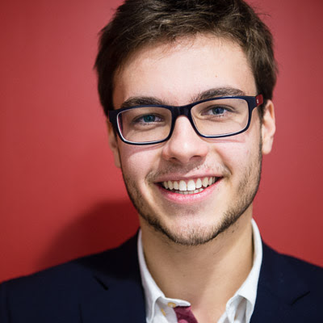

## About Me

Hi! I am a french computer science student, I gratuated from Ecole Centrale Paris, France, and Georgia Institute of Technology, USA.

I am currently doing a Pre-Phd program at the [MLIA](https://mlia.lip6.fr/) team, at the LIP6 lab, in Sorbone Université, Paris. I am mainly working on visual reasoning tasks, such as Visual Question Answering. 

I was previously intern at the [Cognitive Machine Learning team](http://www.lscp.net/persons/dupoux/bootphon/index.html) at Ecole Normale Supérieure, in Paris, as a machine learning research intern.

I'm very interested in machine learning and deep learning, more specifically for robotics, computer vision, and speech processing, and its application for AI research.

## Education

**Master Student, Georgia Institute of Technology, USA**
I'm enrolled in a Computer Science master at Georgia Tech, with specialization in machine learning and interactive intelligence.

**Engineering student, Ecole Centrale Paris, France**
I studied Engineering and Computer Science at Ecole Centrale Paris.

## Internships and projects

**Research Internship, CoML, Spring 2018**  
I interned for 6 months at the [CoML team](http://www.lscp.net/persons/dupoux/bootphon/index.html), a research lab in École Normale Supérieure in Paris. I worked on unsupervised machine learning for words and phoneme discovery
in speech data.

I contributed to the package ABNet3, a siamese neural network for speech embedding. The package is available on github: [https://github.com/bootphon/abnet3](https://github.com/bootphon/abnet3)

**Study of the Variational Auto Encoder for speech subword modeling**  
For a class project, at Georgia Tech, I studied a variational Auto Encoder architecture for the Zerospeech Challenge, Track 1: unsupervised subword modeling. You can find my work here: [https://cdancette.fr/zerospeech-vae/](https://cdancette.fr/zerospeech-vae/)

**Deep learning for optical flow estimation, Fall 2017**  
As a graduate student at Georgia Tech, I worked on a project to estimate optical flows in a natural environment dataset. 
I used the FlowNet2 architecture. You can find my code on [github](https://github.com/cdancette/flownet-tools)

**Software engineering internship, Datadog, Fall 2016**  
I worked in the data engineering team, managing data pipelines with Spark and Hadoop. 

## Publications

1. Rachid Riad, Corentin Dancette, Julien Karadayi, Neil Zeghidour, Thomas Schatz, and Emmanuel Dupoux. ["Sampling strategies in siamese networks for unsupervised speech representation learning."](https://arxiv.org/abs/1804.11297) *Nineteenth Annual Conference of the International Speech Communication Association, Hyderabad, India, September 2018*.

2. Alexis Thual, Corentin Dancette, Julien Karadayi, Juan Benjumea, Emmanuel Dupoux. ["A K-Nearest Neighbors Approach To Unsupervised Spoken Term Discovery."](/assets/knn-approach-unsupervised-std.pdf) To appear in *2018 IEEE Spoken Language Technology Workshop (SLT 2018).*

<!-- 
## Links

## Publications

## Typography

This is a [link](http://google.com). Something *italics* and something **bold**.

Here is a table

Year | Award | Category
-----|-------|--------
2014 | Emmy  | Won Outstanding Lead Actor in a miniseries or a movie
2015 | BAFTA | Nominated for Best Leading Actor for Sherlock
2014 | Satellite | Won Best Actor miniseries or television film

Here is a horizontal rule

---

Here is a blockquote

> To a great mind, nothing is little

## References

* Foo Bar: Head of Department, Placeholder Names, Lorem
* John Doe: Associate Professor, Department of Computer Science, Ipsum
 -->
